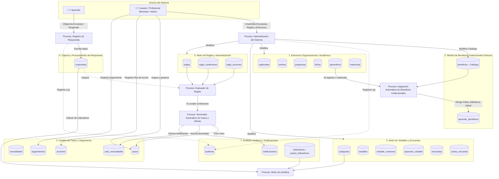
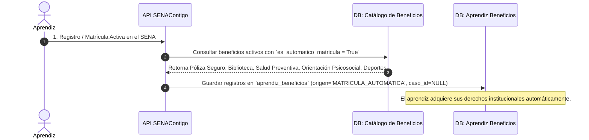
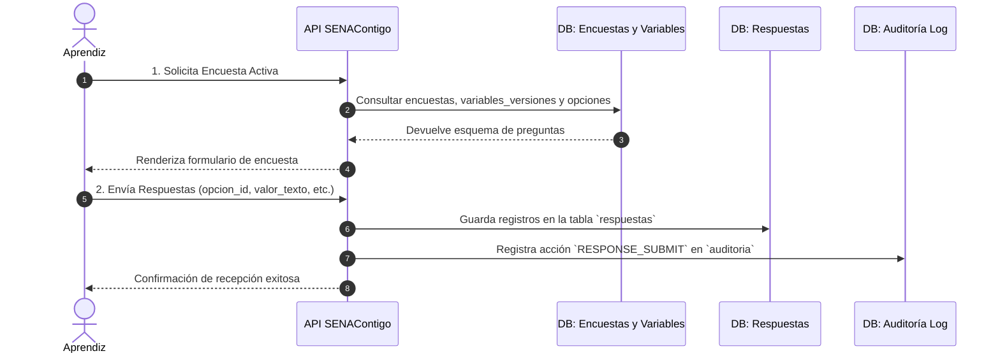
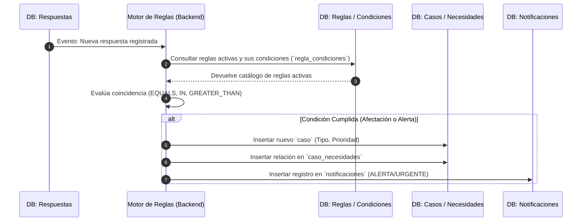
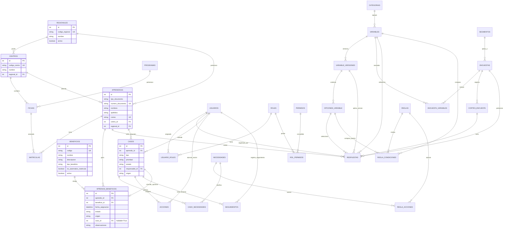

# Diagrama de Flujo de Datos (DFD) y Estructura de Base de Datos - SENAContigo

Este documento proporciona una visión integral del **flujo de datos** y el **modelo entidad-relación (ERD)** de la base de datos de la plataforma **SENAContigo**.

---

## 1. Diagrama del Flujo General de Datos (DFD Nivel 0 / Nivel 1)

El siguiente diagrama representa cómo viaja la información desde la entrada de datos (Aprendices y Usuarios), su almacenamiento en el catálogo de variables/encuestas, su evaluación por el **Motor de Reglas**, la asignación de **Beneficios Institucionales Directos**, la apertura y seguimiento de **Casos de Atención**, hasta la generación de **Notificaciones, Auditoría y Analítica**.

---

## 2. Diagramas de Flujo Específicos por Ciclo de Vida

### A. Flujo de Asignación Directa de Beneficios Institucionales (Desacoplado de Casos/Necesidades)

---

### B. Flujo de Entrada de Datos: Respuestas de Encuestas

---

### C. Flujo de Evaluación de Reglas y Generación de Casos (Motor de Automatización)

---

## 3. Modelo Entidad-Relación de la Base de Datos (ERD)

---

## 4. Descripción de los Módulos de Datos

1. **Beneficios Institucionales Directos (`beneficios`, `aprendiz_beneficios`)**:
   - Gestiona los derechos y beneficios por defecto que posee todo aprendiz SENA (Póliza de seguro, biblioteca, servicios de salud, deportes) de forma independiente y sin pasar por casos de riesgo.
2. **Estructura Académica y Organizacional (`regionales`, `centros`, `programas`, `fichas`, `aprendices`, `matriculas`)**:
   - Mantiene la jerarquía administrativa del SENA y el registro académico de los aprendices inscritos.
3. **Control de Acceso e Identidad (`usuarios`, `roles`, `permisos`)**:
   - Gestiona la autenticación RBAC con restricciones por Regional/Centro.
4. **Parametrización de Encuestas y Variables (`categorias`, `variables`, `variable_versiones`, `opciones_variable`, `encuestas`, `cortes_encuesta`, `segmentos`)**:
   - Versionamiento dinámico de preguntas, respuestas y niveles de afectación.
5. **Respuestas de Aprendices (`respuestas`)**:
   - Registro longitudinal de respuestas tomadas a los aprendices.
6. **Motor de Reglas y Automatización (`reglas`, `regla_condiciones`, `regla_acciones`)**:
   - Analiza las respuestas recibidas y genera automáticamente casos, necesidades y alertas de riesgo.
7. **Gestión de Atención de Casos y Seguimiento (`necesidades`, `casos`, `caso_necesidades`, `acciones`, `seguimientos`)**:
   - Plan de atención para situaciones de riesgo de bienestar.
